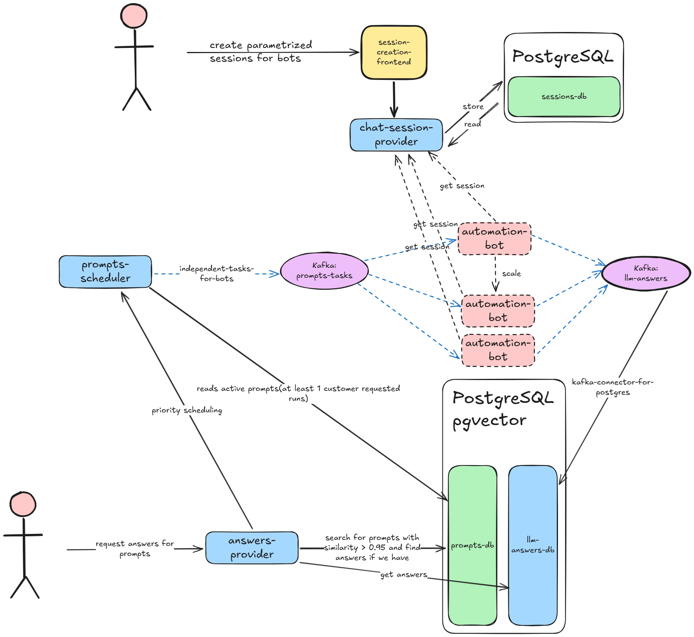

# AI-assistants Answers Platform

## Why

This platform provides a scalable service for retrieving answers from multiple AI assistants (ChatGPT, Claude, Google AI Overview, Perplexity).


- Users submit prompts to the system
- System instantly returns cached answers if available (using vector similarity search for prompts embeddings with threshold > 0.95)
- New prompts(no similarity >= 0.95 in db) are automatically scheduled for execution across AI assistants. Answers is going to be served as soon as they ready with callback
- Answers are stored and become available for future requests

## Overall Architecture



### Main Flows

1. **Session Creation Flow**
   - Backoffice operator creates logins to AI-assistant with created credentials → `session-creation-frontend` → `chat-session-provider` → PostgreSQL (`sessions-db`)
   - Creates and stores authenticated session files for automation bots

2. **Answer Request Flow**
   - Customer → `answers-provider` → PostgreSQL + pgvector (`prompts-db` + `llm-answers-db`)
   - Searches for similar prompts (similarity > 0.95) and returns cached answers instantly
   - Returns existing answers and notifies that prompt is scheduled if no similar prompt found

3. **Automation Flow**
   - `prompts-scheduler` → Kafka (`prompts-tasks`) → `automation-bot` instances (scalable)
   - prompts-scheduler reads prompts which were requested by any client and creates tasks as kafka messages which contains all needed info for automation-bot to evaluate answers
   - Bots get sessions from `chat-session-provider` according to specific info in prompts-tasks(for example target account preferences)
   - Bots execute prompts and produce results to Kafka (`llm-answers`)
   - `kafka-connector-for-postgres` writes answers to PostgreSQL (`llm-answers-db`) with prompt_id foreign key

### Technologies

- **Frontend**: Session creation UI: React
- **Backend Services**: Python-based microservices (chat-session-provider, answers-provider, prompts-scheduler)
- **Databases**: PostgreSQL (sessions as json), PostgreSQL + pgvector (vector similarity search for prompts)
- **Message Queue**: Apache Kafka (prompts-tasks, llm-answers topics)
- **Automation**: Playwright-based bots running in Docker containers
- **Data Integration**: Kafka Connect for PostgreSQL

### Microservices

| Service | Purpose |
|---------|---------|
| `session-creation-frontend` | UI for creating authenticated sessions |
| `chat-session-provider` | Manages and provides bot session files |
| `answers-provider` | Searches cached answers using vector similarity |
| `prompts-scheduler` | Schedules prompt execution tasks to Kafka |
| `automation-bot` | Scalable workers that execute prompts on AI assistants |
| `kafka-connector-for-postgres` | Syncs Kafka messages to PostgreSQL |

## ChatGPT Bot (Current Implementation)

The ChatGPT automation bot is fully implemented and uses:
- **Playwright** for browser automation
- **Docker + Xvfb** for headful browser execution (bypasses Cloudflare detection)
- **Session rotation** to distribute load across multiple Google accounts

### Build Docker Image

```bash
docker build -t chatgpt-automation .
```

### Run with Docker

**Prerequisites:** Create session files locally first:

```bash
uv sync
uv run playwright install chromium
mkdir sessions

# Create sessions for multiple accounts
uv run src/create_session.py --output sessions/account1.json
uv run src/create_session.py --output sessions/account2.json
uv run src/create_session.py --output sessions/account3.json
```

**Run with session rotation:**

```bash
docker run --rm \
  --shm-size=2gb \
  --security-opt seccomp:unconfined \
  -v $(pwd)/prompts.csv:/app/prompts.csv:ro \
  -v $(pwd)/sessions:/app/sessions:ro \
  -v $(pwd)/results:/app/results \
  chatgpt-automation \
  --input /app/prompts.csv \
  --sessions-dir /app/sessions \
  --max-attempts 3 \
  --per-session-runs 5 \
  --output /app/results/output.json
```

**How it works:**
- The bot attempts to get an answer **with citations** for each prompt
- If no citations found, retries up to `--max-attempts` times with the same session
- After max attempts exhausted, switches to a new session and tries once more
- If still no citations, saves an empty response and moves to next prompt

**Input Format** (CSV):
```csv
id,prompt
1,"Find me the best laptops under $1,000"
2,"Compare noise-canceling headphones for commuting"
```

**Output Format** (JSON):
```json
[
  {
    "prompt_id": "1",
    "prompt": "Find me the best laptops under $1,000",
    "answers": [
      {
        "run_number": 1,
        "response": "Here are excellent laptops...",
        "citations": [
          {"url": "https://example.com", "text": "Source"}
        ],
        "timestamp": "2024-01-20T10:30:00.123456"
      }
    ]
  }
]
```

### How it runs as a Docker image and can be scaled

https://github.com/user-attachments/assets/a09b8bb0-af95-4ee1-aa93-09c393372a1a

## Quick Reference

### Local Development

```bash
# Install dependencies
uv sync
uv run playwright install chromium

# Create sessions (one or more)
mkdir sessions
uv run src/create_session.py --output sessions/account1.json

# Run automation
uv run src/bot.py --sessions-dir sessions --input prompts.csv --max-attempts 3

# Run tests
uv run pytest
```

### Docker Arguments

| Argument | Purpose |
|----------|---------|
| `--shm-size=2gb` | Increase shared memory for Chromium |
| `--security-opt seccomp:unconfined` | Allow Chrome sandbox |
| `-v $(pwd)/prompts.csv:/app/prompts.csv:ro` | Mount input CSV (read-only) |
| `-v $(pwd)/sessions:/app/sessions:ro` | Mount sessions directory (read-only) |
| `-v $(pwd)/results:/app/results` | Mount results directory (read-write) |

### Application Arguments

| Argument | Purpose | Example | Required |
|----------|---------|---------|----------|
| `--input` | Input CSV file | `/app/prompts.csv` | No (default: `prompts.csv`) |
| `--sessions-dir` | Directory with session files | `/app/sessions` | **Yes** |
| `--max-attempts` | Max attempts to get citations per prompt | `3` | No (default: `1`) |
| `--per-session-runs` | Attempts before session switch | `5` | No (default: `10`) |
| `--output` | Output JSON file | `/app/results/output.json` | No (default: `chatgpt_results.json`) |
