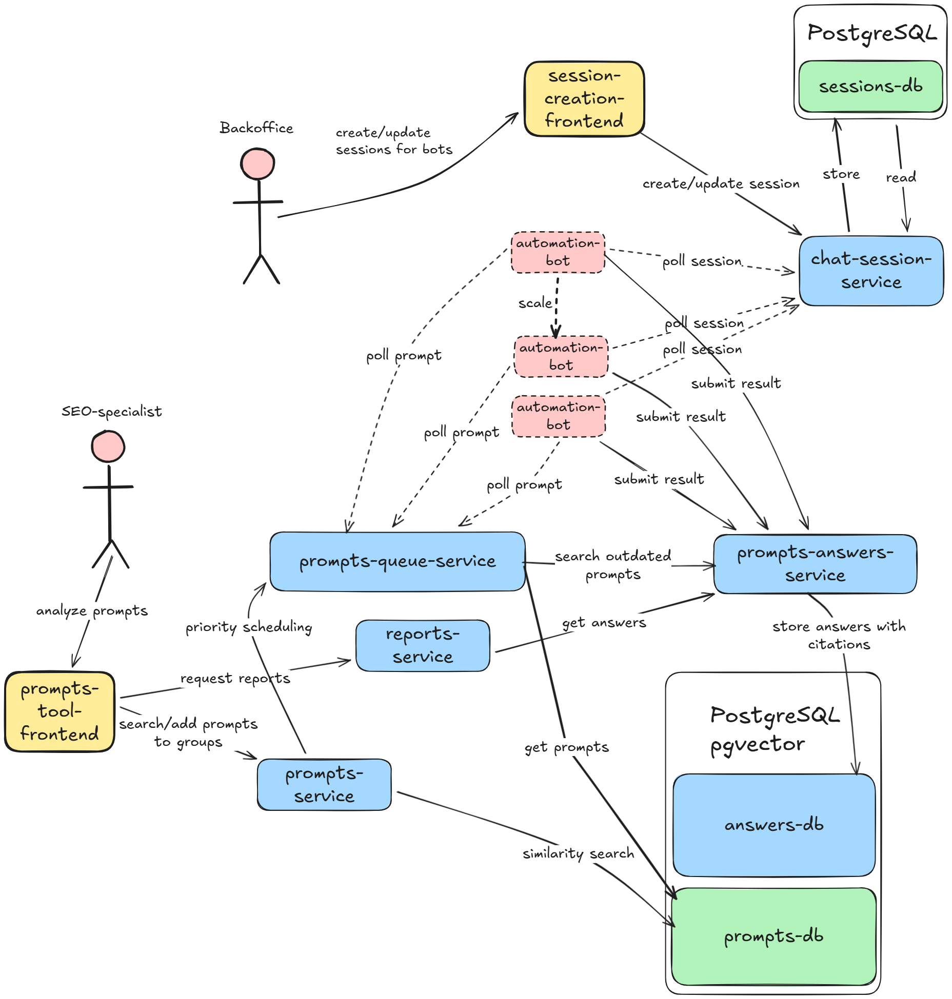

# AI-assistants Answers Platform

## Why

This platform provides a scalable service for retrieving answers from multiple AI assistants (ChatGPT, Claude, Google AI Overview, Perplexity).


- Prompts are evaluating using native-browser bots based on Playwright.
- Platform provides answers instantly for prompts which are already in db(which means were executed before).
- Platform suggests user to use prompts which are similar to requested, for which we already have data.
- If user brings new prompts inside system we evaluate them with priority and add for periodic execution to our db.
- Answers are stored and become available for future requests.

## Overall Architecture



## ChatGPT Bot (Current Implementation)

The ChatGPT automation bot is fully implemented and uses:
- **Playwright** for browser automation
- **Docker + Xvfb** for headful browser execution (bypasses Cloudflare detection)
- **Session rotation** to distribute load across multiple Google accounts
- **HTTP API polling** for continuous prompt processing with atomic claim semantics

### Build Docker Image

```bash
docker build -t chatgpt-automation .
```

### Environment Configuration

For Docker deployments, configure the bot using environment variables:

**1. Copy the example environment file:**
```bash
cp .env.example .env
```

**2. Edit `.env` with your configuration:**
```bash
# Required settings
API_URL=http://your-backend-api:8000
RESULTS_API_URL=http://your-backend-api:8000

# Optional settings (defaults shown)
SESSIONS_DIR=/app/sessions
ASSISTANT_NAME=ChatGPT
PLAN_NAME=Plus
MAX_ATTEMPTS=3
PER_SESSION_RUNS=10
POLL_RETRY_SECONDS=10
IDLE_TIMEOUT_MINUTES=30
```

**Note:** The `.env` file is git-ignored to prevent committing sensitive configuration.

### Run with Docker

**Prerequisites:** Create session files locally first:

```bash
uv sync
uv run playwright install chromium
mkdir sessions

# Create sessions for multiple accounts
uv run scripts/create_session.py --output sessions/account1.json
uv run scripts/create_session.py --output sessions/account2.json
uv run scripts/create_session.py --output sessions/account3.json
```

**Run in HTTP API polling mode (continuous operation):**

**Approach 1: Using .env file (Recommended)**
```bash
docker run --rm \
  --shm-size=2gb \
  --security-opt seccomp:unconfined \
  --env-file .env \
  -v $(pwd)/sessions:/app/sessions:ro \
  chatgpt-automation
```

**Approach 2: Using individual environment variables**
```bash
docker run --rm \
  --shm-size=2gb \
  --security-opt seccomp:unconfined \
  -e API_URL=http://your-backend-api:8000 \
  -e RESULTS_API_URL=http://your-backend-api:8000 \
  -e SESSIONS_DIR=/app/sessions \
  -e ASSISTANT_NAME=ChatGPT \
  -e PLAN_NAME=Plus \
  -e MAX_ATTEMPTS=3 \
  -e PER_SESSION_RUNS=10 \
  -e POLL_RETRY_SECONDS=10 \
  -e IDLE_TIMEOUT_MINUTES=30 \
  -v $(pwd)/sessions:/app/sessions:ro \
  chatgpt-automation
```

**Note:** Any additional CLI arguments passed to the container will override environment variable settings.

**How it works:**

The bot runs continuously, polling the backend API for prompts:

1. **Poll for prompt** - Sends POST request to `/evaluations/api/v1/poll` with assistant and plan preferences
   - Returns prompt with `evaluation_id` when available
   - Returns empty response when queue is empty (non-blocking)

2. **Get session** - Selects next session from the pool using round-robin rotation
   - Automatically switches sessions after `--per-session-runs` evaluations

3. **Initialize browser** - Loads authenticated session (cookies + storage)
   - Handles any authentication modals automatically

4. **Evaluation loop** - Attempts to get response with citations (up to `--max-attempts` times)
   - Starts new conversation for each retry
   - Extracts citations from ChatGPT response
   - If citations found → proceed to submit

5. **Force retry with fresh session** - After max attempts exhausted
   - Switches to a new session
   - Tries one final time

6. **Submit result** - Two paths based on success:
   - **Success (has citations)**: POST to `/evaluations/api/v1/submit` with answer and citations
   - **Failure (no citations)**: POST to `/evaluations/api/v1/release` to mark evaluation as failed

7. **Wait and repeat** - When no prompts available, waits `--poll-retry-seconds` before next poll

**Graceful shutdown:**
- Press Ctrl+C to stop processing
- Browser closes after `--idle-timeout-minutes` of inactivity (if specified)

### HTTP API Integration

The bot integrates with the backend API service using a continuous polling mechanism. This enables atomic claim semantics and distributed processing across multiple bot instances.

#### API Endpoints

**1. Poll for Prompts**
- **Endpoint:** `POST /evaluations/api/v1/poll`
- **Purpose:** Claim next available prompt evaluation
- **Request:**
  ```json
  {
    "assistant_name": "ChatGPT",
    "plan_name": "Plus"
  }
  ```
- **Response (prompt available):**
  ```json
  {
    "evaluation_id": 123,
    "prompt_id": 456,
    "prompt_text": "What are the best laptops under $1,000?",
    "topic_id": 1,
    "claimed_at": "2025-12-09T10:30:00Z"
  }
  ```
- **Response (no prompts):**
  ```json
  {
    "evaluation_id": null,
    "prompt_id": null,
    "prompt_text": null,
    "topic_id": null,
    "claimed_at": null
  }
  ```

**2. Submit Successful Evaluation**
- **Endpoint:** `POST /evaluations/api/v1/submit`
- **Purpose:** Submit answer with citations
- **Request:**
  ```json
  {
    "evaluation_id": 123,
    "answer": {
      "response": "Here are excellent laptops under $1,000...",
      "citations": [
        {
          "url": "https://example.com/laptop-review",
          "text": "TechRadar: Best Budget Laptops 2025"
        }
      ],
      "timestamp": "2025-12-09T10:35:00Z"
    }
  }
  ```
- **Response:**
  ```json
  {
    "evaluation_id": 123,
    "status": "submitted"
  }
  ```

**3. Release Failed Evaluation**
- **Endpoint:** `POST /evaluations/api/v1/release`
- **Purpose:** Release evaluation back to queue when unable to get citations
- **Request:**
  ```json
  {
    "evaluation_id": 123,
    "mark_as_failed": true,
    "failure_reason": "No citations found after 3 attempts"
  }
  ```
- **Response:**
  ```json
  {
    "evaluation_id": 123,
    "action": "released"
  }
  ```

### How it works together with [prompts-volume](https://github.com/rosklyar/prompts-volume)
#### Run prompts-volume
https://github.com/user-attachments/assets/bb5a9092-b767-4347-8a78-1587f652b985
#### Run automation bot
https://github.com/user-attachments/assets/1d13c621-ee50-4ffb-b97d-5accc1384e2b

### Dockerized bot demo
https://github.com/user-attachments/assets/a09b8bb0-af95-4ee1-aa93-09c393372a1a

## Quick Reference

### Local Development

```bash
# Install dependencies
uv sync
uv run playwright install chromium

# Create sessions (one or more)
mkdir sessions
uv run scripts/create_session.py --output sessions/account1.json

# Run automation with HTTP API polling
uv run src/bot.py \
  --sessions-dir sessions \
  --api-url http://localhost:8000 \
  --results-api-url http://localhost:8000 \
  --assistant-name ChatGPT \
  --plan-name Free \
  --max-attempts 3 \
  --poll-retry-seconds 10 \
  --idle-timeout-minutes 30

# Run tests
uv run pytest
```

### Docker Arguments

| Argument | Purpose |
|----------|---------|
| `--shm-size=2gb` | Increase shared memory for Chromium |
| `--security-opt seccomp:unconfined` | Allow Chrome sandbox |
| `-v $(pwd)/sessions:/app/sessions:ro` | Mount sessions directory (read-only) |

### Application Arguments

| Argument | Environment Variable | Purpose | Example | Required |
|----------|---------------------|---------|---------|----------|
| `--api-url` | `API_URL` | Base URL for HTTP API prompt source | `http://localhost:8000` | **Yes** |
| `--results-api-url` | `RESULTS_API_URL` | Base URL for HTTP API result submission | `http://localhost:8000` | **Yes** |
| `--sessions-dir` | `SESSIONS_DIR` | Directory with session files | `/app/sessions` | **Yes** |
| `--assistant-name` | `ASSISTANT_NAME` | Assistant name for API requests | `ChatGPT` | No (default: `ChatGPT`) |
| `--plan-name` | `PLAN_NAME` | Plan name for API requests | `Plus` | No (default: `Plus`) |
| `--max-attempts` | `MAX_ATTEMPTS` | Max attempts to get citations per prompt | `3` | No (default: `1`) |
| `--per-session-runs` | `PER_SESSION_RUNS` | Evaluations per session before rotation | `10` | No (default: `10`) |
| `--poll-retry-seconds` | `POLL_RETRY_SECONDS` | Seconds to wait when no prompts available | `10` | No (default: `5.0`) |
| `--idle-timeout-minutes` | `IDLE_TIMEOUT_MINUTES` | Close browser after N minutes of inactivity | `30` | No (default: never) |
| `--api-timeout` | `API_TIMEOUT` | API request timeout in seconds | `30.0` | No (default: `30.0`) |
| `--submit-retry-attempts` | `SUBMIT_RETRY_ATTEMPTS` | Max retry attempts for submitting results | `3` | No (default: `3`) |
| `--submit-timeout` | `SUBMIT_TIMEOUT` | Result submission timeout in seconds | `30.0` | No (default: `30.0`) |
| `--log-level` | `LOG_LEVEL` | Logging level | `INFO` | No (default: `INFO`) |
| `--log-file` | `LOG_FILE` | Optional log file path | `/app/logs/bot.log` | No (default: console only) |

**Configuration Methods:**
- **Docker**: Use environment variables via `.env` file (recommended) or `-e` flags. The `entrypoint.sh` script converts them to CLI arguments.
- **Local Development**: Use CLI arguments directly with `uv run src/bot.py`.
